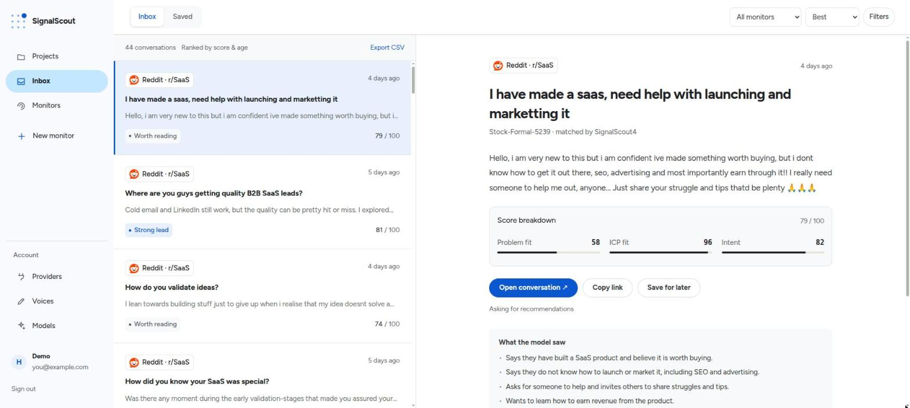

# SignalScout

**Open-source AI intent monitoring.** Find the people publicly describing the
problem your product solves — and read why each one scored.



**[Try SignalScout Cloud →](https://www.signalscout.run)** — the same
application, on our servers, with the provider keys already in place. It
charges for not running a server, never for a feature this build lacks.

Or run it yourself. No git, no Node, no build — one compose file and the
published image:

```bash
curl -O https://raw.githubusercontent.com/rszhd/signalscout/main/docker-compose.yml
curl -o .env https://raw.githubusercontent.com/rszhd/signalscout/main/.env.example.self-hosted
echo "AUTH_SECRET=$(openssl rand -base64 32)" >> .env
echo "ENCRYPTION_KEY=$(openssl rand -base64 32)" >> .env
docker compose up -d
```

The app is then on <http://localhost:3000>, asking you to make the first
account. [Running it](#running-it) has the rest.

---

Traditional social listening answers *who mentioned my brand*. SignalScout
answers a different question:

> Who is publicly describing a problem my product can solve?

You describe what you sell, who buys it, and what problems you solve.
SignalScout searches Reddit, X, LinkedIn, YouTube, TikTok and Instagram — posts
and the comments underneath them — and uses a model to read each conversation
and score it: relevance, problem fit, ICP fit, buyer intent, urgency. What you
get is not a dashboard. It is an inbox of people who might need what you build.

---

## How it works

```
Reddit    ─┐
X         ─┤
LinkedIn  ─┤
YouTube   ─┼─► posts and comments ─► keyword ─► embedding ─► triage ─► scoring
TikTok    ─┤                             the three cheap stages    the good model
Instagram ─┘                                                                 │
                                                     relevance · ICP · intent
                                                                             │
                                                                     lead score
                                                                             │
                                  ┌─────────┬─────────┬─────────┬────────────┐
                                inbox     email    webhook     CSV         draft
```

**The cheap stages matter.** A post has to match a word, then clear a
similarity threshold, then survive a one-word question from a cheap model,
before the good model is paid to read it. On keyword noise that removes most of
the bill. Inside a topical subreddit it removes almost nothing, because
everything there is already about the subject — so the arithmetic on the
monitor form assumes the expensive case.

**Nothing is posted from here.** A match has a *Draft reply* button that asks a
model once and puts the text in a box with a copy action. Publishing to a
social network is on PLAN.md's *not building* list, and the feature ends at the
clipboard.

---

## Your accounts, your keys, your data

SignalScout ships the integrations. You own the accounts. Nothing is proxied
through us, and no data leaves your instance.

Six platforms arrive through four data providers — ScrapeCreators and
SocialCrawl for Reddit, YouTube and TikTok, SocialCrawl and SocialData for X,
Apify for LinkedIn, and SocialCrawl for Instagram. You bring a key for the
providers you actually use, and one Reddit key plus one model key is already a
useful product. ScrapeCreators and SocialCrawl both have a free tier that needs
no card.

A key lives in `.env`, where it belongs to the machine, or on a screen, where
it is tested with the provider before it is stored and belongs to the account
that pasted it. The model is yours to choose too — OpenAI, Anthropic, Google,
DeepSeek, OpenRouter or Ollama, in three lines and no code path per provider.

Read [Providers and keys](https://docs.signalscout.run/self-hosting/keys) for which variable is which,
and [docs/secrets.md](docs/secrets.md) for what encryption promises.

### What it costs

**The money is spent at fetch time**, before any filter sees the text. So every
monitor has a monthly cap, every query can be cost-tested before it runs, and
the app shows what it spent.

Roughly: a Reddit post costs $0.0003 to $0.0015 depending on the provider, an X
post $0.0002, a LinkedIn post $0.002, and classifying one about $0.001 on a
cheap model. Instagram is the outlier, because its leads are in the comments
and a comment page is five credits — one live poll spent five times more with
the provider than with the model.

Every figure the app shows is an estimate. [docs/costs.md](docs/costs.md) has
the price of every connector and the six ways that arithmetic is wrong.

---

## Why it goes through data providers

Reddit closed self-serve API registration in November 2025, and getting a
client id now means a manual approval that small projects report being refused.
X's own API sells the same searches at $0.005 per post read with no free tier.
The other four platforms have no path that gives a small self-hosted tool a
keyword search over strangers' posts.

So every platform arrives through a data provider, and you bring that
provider's key. **Be clear about what that means**, because it is not a free
pass. Your data arrives through a company that is not the platform. You sign
that company's agreement instead of the platform's, and that agreement puts the
compliance burden on you: you warrant that your use violates no third party's
rights, and you indemnify them if it does. The question of whether commercial
monitoring is allowed did not go away. It moved onto you, and it became less
visible.

We think that is the honest trade for an open-source tool, and we would rather
say it here than let you find it in an agreement you skimmed.

[STACK.md](STACK.md) has the measurements behind each choice, and
[docs/sources.md](docs/sources.md) has what each connector can and cannot do.

---

## Running it

The five lines at the top are the whole install: one Postgres and one Node
process, designed for a 1 GB server, from an image CI publishes for Intel and
ARM. On first boot the app asks you to make the first account, and refuses
every registration after it.

**[The self-hosting guide](https://docs.signalscout.run/self-hosting/)** has
the rest, with a diagram where one helps: the two secrets, providers and
keys, AI models, HTTPS, email and webhooks, what it costs, backups and
upgrades, troubleshooting, and every setting. **Put it behind HTTPS before you
give it a public address.**

**To change the code**, clone it and build the image yourself:

```bash
git clone https://github.com/rszhd/signalscout
cd signalscout
pnpm setup
docker compose -f docker-compose.yml -f docker-compose.build.yml up --build
```

---

## What this is not

No sentiment charts, no share of voice, no word clouds, no competitor
analytics, no social publishing, no CRM. Those are good products. They are not
this one.

The scope is one sentence: **find conversations with intent.**

---

## Roadmap

**Next is detection quality, not a seventh platform.** Thirty human verdicts
on real matches, to say whether the score is right (US-033); a harness that
compares a triage rule instead of arguing about it (US-231); and an evaluation
model for the cheap stage that decides what the good model reads (US-232).

**Refused, and staying refused.** Publishing a reply from here — the draft ends
at the clipboard. Sentiment charts, share of voice, competitor analytics, a
CRM. And another social network before the existing ones reliably produce
useful matches; the rule has been crossed four times, each on the owner's
decision and each recorded in its ticket.

**Measured, not guessed.** The first question is not stars or signups. It is
whether people who run this receive matches they find valuable, and whether
they keep the monitors running.

[backlog/OPEN.md](backlog/OPEN.md) is every open ticket with its reasoning.
[PLAN.md](PLAN.md) is why the scope is one sentence. This section is written
by hand and says less than both on purpose.

---

## Repository

**To run or use SignalScout**, read
[docs.signalscout.run](https://docs.signalscout.run): getting started, using
the product, the cloud, self-hosting and every setting. Its source is
[`site/`](site/README.md), so a fix to a page is a pull request like any
other.

**To change the code**, start here:

| | |
|---|---|
| [docs/map.md](docs/map.md) | Ten minutes: what runs, where it lives, how one poll and one request go |
| [PLAN.md](PLAN.md) | What we are building, and why |
| [STACK.md](STACK.md) | What we are building it with, and why not the alternatives |
| [docs/pipeline.md](docs/pipeline.md) | The worker's run in order, the caps that stop it, and what each step writes |
| [docs/sources.md](docs/sources.md) | Adding a platform, adding a provider, switching one off |
| [docs/costs.md](docs/costs.md) | What our spend figure is, and what it is wrong about |
| [docs/secrets.md](docs/secrets.md) | Where a key lives, what encryption promises, what rotation does |
| [docs/accounts.md](docs/accounts.md) | Who may register, whose keys pay, what the login protects |
| [docs/notifications.md](docs/notifications.md) | The outbox, what an email is, the signing secret, where a webhook may point |
| [docs/deletions.md](docs/deletions.md) | How a removed post stops being shown |
| [docs/self-hosting.md](docs/self-hosting.md) | Adding a setting, the image, and what the install guide promises |
| [docs/design.md](docs/design.md) | This application's screens and layouts |
| [packages/ui/](packages/ui/README.md) | The brand both applications wear: tokens, the spacing scale, shared controls |
| [docs/testing.md](docs/testing.md) | How the tests are written, and what a green suite cannot say |
| [docs/instruments.md](docs/instruments.md) | Every command that spends money, what it asks and what it costs |
| [docs/releasing.md](docs/releasing.md) | Cutting a version of the packages and the image |
| [CHANGELOG.md](CHANGELOG.md) | What each published package version changed for a consumer |
| [packages/engine/](packages/engine/README.md) | The stateless half, on npm: connectors, model calls, the cipher |
| [packages/pipeline/](packages/pipeline/README.md) | The stateful half, on npm: the tables, the queues, the migrations |
| [backlog/](backlog/README.md) | One ticket per file; the folder is the status |
| [AGENTS.md](AGENTS.md) | Instructions for AI coding agents working in this repo |
| [AI_POLICY.md](AI_POLICY.md) | How AI may be used here, by the owner and by a contributor |
| [SECURITY.md](SECURITY.md) | Reporting a hole privately, and what is in scope |

---|---|
| [docs/map.md](docs/map.md) | Ten minutes: what runs, where it lives, how one poll and one request go |
| [PLAN.md](PLAN.md) | What we are building, and why |
| [STACK.md](STACK.md) | What we are building it with, and why not the alternatives |
| [docs.signalscout.run](https://docs.signalscout.run) | **The guides for people who run SignalScout**: getting started, self-hosting, every setting. Source in [`site/`](site/README.md) |
| [docs/self-hosting.md](docs/self-hosting.md) | The same install, as the contributor keeps it |
| [docs/sources.md](docs/sources.md) | Adding a platform, adding a provider, switching one off |
| [docs/costs.md](docs/costs.md) | What our spend figure is, and what it is wrong about |
| [docs/secrets.md](docs/secrets.md) | Where a key lives, what encryption promises, how to rotate |
| [docs/accounts.md](docs/accounts.md) | Accounts, TLS, verifying an address by hand, getting back in |
| [docs/notifications.md](docs/notifications.md) | SMTP setup and the webhook contract |
| [docs/deletions.md](docs/deletions.md) | How a removed post stops being shown |
| [docs/pipeline.md](docs/pipeline.md) | The worker's run in order, the caps that stop it, and what each step writes |
| [docs/design.md](docs/design.md) | This application's screens and layouts |
| [packages/ui/](packages/ui/README.md) | The brand both applications wear: tokens, the spacing scale, shared controls |
| [docs/testing.md](docs/testing.md) | How the tests are written, and what a green suite cannot say |
| [docs/instruments.md](docs/instruments.md) | Every command that spends money, what it asks and what it costs |
| [docs/releasing.md](docs/releasing.md) | Cutting a version of the packages and the image |
| [CHANGELOG.md](CHANGELOG.md) | What each published package version changed for a consumer |
| [packages/engine/](packages/engine/README.md) | The stateless half, on npm: connectors, model calls, the cipher |
| [packages/pipeline/](packages/pipeline/README.md) | The stateful half, on npm: the tables, the queues, the migrations |
| [backlog/](backlog/README.md) | One ticket per file; the folder is the status |
| [AGENTS.md](AGENTS.md) | Instructions for AI coding agents working in this repo |
| [AI_POLICY.md](AI_POLICY.md) | How AI may be used here, by the owner and by a contributor |
| [SECURITY.md](SECURITY.md) | Reporting a hole privately, and what is in scope |

---

## Contributing

**What helps most, right now:**

- **Verdicts on real matches.** If you run an instance, say whether the score
  was right. Thirty judged matches settle a question no test can
  ([#32](https://github.com/rszhd/signalscout/issues/32)), and it needs no
  code at all.
- **A provider for a platform already fetched.** A second way to reach Reddit,
  X, LinkedIn, YouTube, TikTok or Instagram. One folder and one registry
  entry — [docs/sources.md](docs/sources.md) has the list.
- **A fixture captured from a real response.** We never write one from memory;
  Instagram alone contradicted three of its provider's documented claims.
- **A connector's edge case you hit in the wild**, with the payload that
  caused it.
- **A doc that was wrong or missing** when you followed it.

[Issues labelled **good first issue** or **help wanted**](https://github.com/rszhd/signalscout/issues?q=is%3Aissue+is%3Aopen+label%3A%22good+first+issue%22%2C%22help+wanted%22)
are the ones with a whole evening's shape. Each mirrors a ticket file, which
holds the reasoning and the definition of done.

**A seventh social network is refused.** PLAN.md holds one rule above the
others:

> Do not add another social network until Reddit and X reliably produce useful
> matches.

A product with two sources that surfaces five genuinely valuable conversations a
day beats one with twenty sources generating hundreds of noisy alerts. Six
platforms are in the build, and the rule has been crossed four times — each on
the owner's decision, each recorded in its ticket rather than left to look like
an oversight. It is still the rule, and a pull request adding a seventh meets
this same answer.

This repository is written with an AI coding agent, and you may use one too.
[AI_POLICY.md](AI_POLICY.md) is the rule: understand every line you submit,
say what you used, sign as yourself. [AGENTS.md](AGENTS.md) is what the agent
reads.

**Where to put what.** A question, or an install that will not start, goes to
[Discussions](https://github.com/rszhd/signalscout/discussions). A bug or a
request goes to [the forms](https://github.com/rszhd/signalscout/issues/new/choose).
A security hole goes to a
[private advisory](https://github.com/rszhd/signalscout/security/advisories/new),
never to an issue — [SECURITY.md](SECURITY.md) says what is in scope.

---

## License

[Apache-2.0](LICENSE). Use it, change it, run it inside your company, sell a
service built on it. The license adds an express patent grant, which MIT does
not have.

Copyleft was considered and refused, and the reason is worth stating rather than
implying: this product's moat is convenience and not code. The hosted version
charges for not running a server, not for features the self-hosted build lacks,
so a network clause would protect nothing — while many companies ban AGPL
software by policy, which would shut out the exact people meant to be running
this. The argument in full is in
[US-019](backlog/done/2026-09/US-019-the-project-has-a-license.md).

Contributions come in under the [DCO](CONTRIBUTING.md): one `Signed-off-by`
line, no paperwork.
