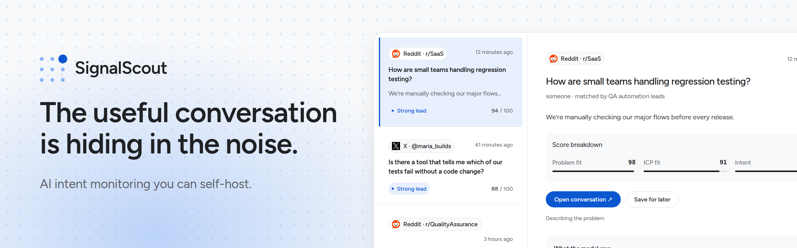

<p align="center">
  <a href="https://www.signalscout.run">
    
  </a>
</p>

<p align="center">
  <b>AI intent monitoring you can self-host.</b> Find the people publicly
  describing the problem your product solves — and read why each one scored.
</p>

<p align="center">
  <a href="https://www.signalscout.run"><b>Try SignalScout Cloud</b></a> •
  <a href="https://docs.signalscout.run"><b>Docs</b></a> •
  <a href="#running-it"><b>Self-host it</b></a>
</p>

You describe what you sell, who buys it, and what problem you solve.
SignalScout searches Reddit, X, LinkedIn, YouTube, TikTok and Instagram, reads
each conversation with an AI model, and scores it: problem fit, fit with your
customer, and buyer intent. What you get is not a dashboard. It is an inbox of
people who might need what you build.

**[Try SignalScout Cloud →](https://www.signalscout.run)** — the same
application, on our servers, with the provider keys already in place. It
charges for not running a server, never for a feature this build lacks.

---

## Running it

**You need** a machine with Docker and Docker Compose, and about 1 GB of
memory. The image runs on Intel and ARM.

**1. Start it.** No git, no Node, no build:

```bash
curl -O https://raw.githubusercontent.com/rszhd/signalscout/main/docker-compose.yml
curl -o .env https://raw.githubusercontent.com/rszhd/signalscout/main/.env.example.self-hosted
echo "AUTH_SECRET=$(openssl rand -base64 32)" >> .env
echo "ENCRYPTION_KEY=$(openssl rand -base64 32)" >> .env
docker compose up -d
```

Open <http://localhost:3000> and make your account. The first account is the
only one: sign-up closes after it.

**2. Add two keys.** Next, the app asks for two keys. It cannot search or
read anything without them:

- **A data provider key**, to fetch posts. Start with
  [ScrapeCreators](https://scrapecreators.com) for Reddit: it has a free tier
  and needs no card.
- **An AI model key**, to score them — OpenAI, Anthropic, Google, DeepSeek or
  OpenRouter. Ollama on your own machine needs no key.

Paste them on that screen. Or put them in `.env`, and run
`docker compose up -d` again.
[Providers and keys](https://docs.signalscout.run/self-hosting/keys) says
which provider fetches which platform.

**3. Make your first monitor.**
[Your first match](https://docs.signalscout.run/getting-started/first-match)
walks you through it in about ten minutes.

> [!WARNING]
> **Before you give it a public address**, change the database password and
> put it behind HTTPS.
> [Before the server is public](https://docs.signalscout.run/self-hosting/install#before-the-server-is-public)
> says how.

**[The self-hosting guide](https://docs.signalscout.run/self-hosting/)** has
the rest: email and webhooks, backups and upgrades, troubleshooting, and every
setting.

---

## How it works

```
Reddit    ─┐
X         ─┤
LinkedIn  ─┤
YouTube   ─┼─► posts and comments ─► keyword ─► embedding ─► triage ─► scoring
TikTok    ─┤                             the three cheap stages    the good model
Instagram ─┘                                                                 │
                                                                     lead score
                                                                             │
                                  ┌─────────┬─────────┬─────────┬────────────┐
                                inbox     email    webhook     CSV         draft
```

A post must pass three cheap filters before the good model is paid to read it.
On a broad keyword search, that removes most of the cost.

**Nothing is posted from here.** *Draft reply* writes a reply for you to copy.
You post it yourself.

## What it costs

You pay the data provider for each post it fetches, and the model provider for
each post the model reads. Roughly: a Reddit post costs $0.0003 to $0.0015 to
fetch, and scoring it costs about $0.001 on a cheap model. Every monitor has a
monthly cap, and the app shows what it spent.
[What it costs](https://docs.signalscout.run/self-hosting/costs) has the price
of every provider.

## What this is not

No sentiment charts, no share of voice, no word clouds, no competitor
analytics, no social publishing, no CRM. Those are good products. They are not
this one.

The scope is one sentence: **find conversations with intent.**

---

## Help and contributing

- **A question, or an install that will not start:**
  [Discussions](https://github.com/rszhd/signalscout/discussions).
- **A bug or a request:** [the issue forms](https://github.com/rszhd/signalscout/issues/new/choose).
- **A security hole:** a
  [private advisory](https://github.com/rszhd/signalscout/security/advisories/new),
  never an issue. [SECURITY.md](SECURITY.md) says what is in scope.
- **To change the code for your own use:** start with
  [docs/map.md](docs/map.md). Pull requests from outside wait for now;
  [CONTRIBUTING.md](CONTRIBUTING.md) says why.

The help that needs no code: if you run an instance, say whether the score on
your matches was right ([#32](https://github.com/rszhd/signalscout/issues/32)).

## License

SignalScout is **fair source**, under the
[Functional Source License](LICENSE) (FSL-1.1-ALv2). The source is public,
but it is not open source.

**You may** self-host it and use it, in a business too. You may change the
code and run your changed copy. An agency may run its own instance to find
leads for its clients, and send them the results.

**You may not** sell the code or a changed copy, sell it as a hosted
service, or give your clients a login to your instance.

**Each version becomes Apache-2.0 two years after its release.** Versions up
to 0.14.0 were released under Apache-2.0 and stay under it.
[US-379](backlog/done/2026-09/US-379-the-code-is-fair-source-under-the-fsl.md) says
why the license changed.
