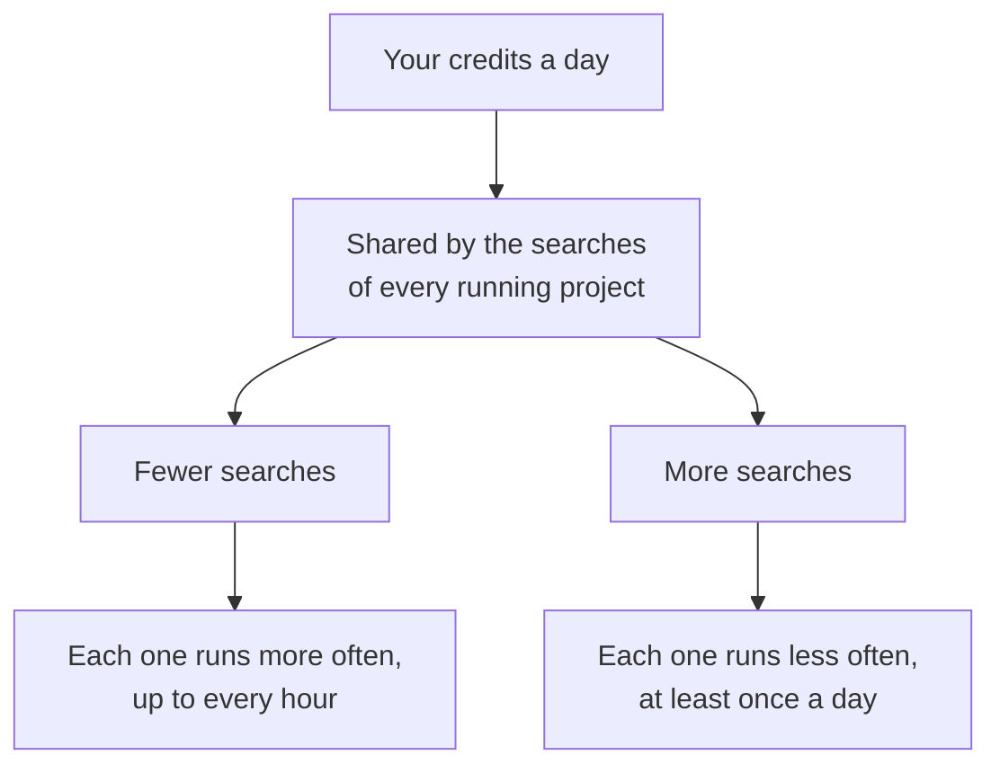

# Plans and billing

Each plan sets how many projects you may have, how many searches may run a
day, which platforms you can watch, and how many reply drafts you may write a
month. The [pricing page](https://www.signalscout.run/pricing) has the
numbers for each plan.

## Search credits

A plan gives you **search credits** each day. One credit runs one search, on
one platform, once. Every platform uses one credit a search, LinkedIn
included.

Your credits are shared across all your projects, and SignalScout sets the
schedule from them:

So a paused project frees its credits, and the others run more often. A new
project with many searches slows the rest down. Your monitor page shows how
often each search runs.

## Usage

Every search and every AI call counts against your plan's monthly usage. The
**Billing** screen shows it as a share: *Share of this month's usage*. It
resets on your billing date.

Two limits stop one busy day from using up the month. If a day's limit is
reached, collecting pauses until the next day (UTC), and the Billing screen
says which limit it was.

### When the usage is spent

Polling and paid actions (reply drafts, cost tests) pause until your next
billing date. **Nothing is deleted.** Your projects, matches and drafts stay
as they are, and you can still read your inbox and export it.

To use less, pause a project, or remove searches and platforms from it.
Fewer searches and fewer platforms are the two levers.

## Subscribe, change or cancel

Open **Billing** in the sidebar.

- **Subscribe**: choose a plan. Payment is handled by Stripe.
- **Change your plan, card or invoices, or cancel**: press **Manage billing**.
  It opens Stripe's billing page.

<!-- screenshot: the billing screen with the current plan and usage -->

| You do this | What happens |
|---|---|
| **Upgrade** | The larger plan applies at once. Stripe charges the difference for the rest of the month. |
| **Downgrade** | If your projects no longer fit the smaller plan, the newest ones are **paused, not deleted**. Each says *Paused by your plan*. Resume one when there is room. |
| **Cancel** | Your subscription runs to the end of the period you paid for. After that, collecting stops, and your inbox stays readable. |

## If a payment fails

Your projects keep running while Stripe retries the card, and the Billing
screen says *Payment needs attention*. Update the card with
**Manage billing**. Collecting stops only if Stripe stops retrying and ends
the subscription.

## When the trial ends without a subscription

You can still sign in, read your inbox and export it. New searches, cost
tests and reply drafts wait until you subscribe. Subscribing starts
collecting again on the next run, and nothing needs to be set up again.
