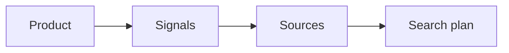

# SignalScout Cloud

SignalScout Cloud is the same product, run by us at
[app.signalscout.run](https://app.signalscout.run). You do not set up a
server, and you do not bring any keys: the data providers and the AI model
are included in your plan.

## How it differs from self-hosting

| | Cloud | Self-hosted |
|---|---|---|
| **Keys** | None. Search and AI usage are included. | You bring a key for each provider and model. |
| **Cost** | A monthly plan, with a usage allowance | Free software; you pay your providers |
| **A project** | Is one monitor, set up with it | Can hold several monitors |
| **Schedule** | Set by your plan | You choose it per monitor |
| **Budget** | Your plan's allowance | A monthly cap you set per monitor |
| **Sign-up** | Email confirmation, and password reset by email | You decide; see [accounts](../self-hosting/accounts) |
| **Screens you will not see** | Providers, Connections, Models | — |

Everything else in these guides is the same: the [inbox](../using/inbox),
[reply drafts](../using/replies), [notifications](../using/notifications)
and [webhooks](../self-hosting/webhooks).

## Set up a project

On the cloud, a project and its monitor are made together, in four steps:

There is no fifth step for the schedule and the budget, because your plan
decides both. The project's monitor page shows the schedule under
**Schedule**, marked *Set by your plan*.

## Your account

- **Create an account** with your name, email and a password. Open the link
  in the confirmation email to finish. The link works for 24 hours.
- **Forgot your password?** Press **Forgot your password?** on the sign-in
  screen. A reset link arrives by email and works for one hour.
- **Nothing arrived?** Look in the spam folder. Signing in also sends a new
  confirmation link.

## The free trial

Every account starts with a seven-day trial. **No card is needed.** The
trial is a small plan: the sign-up screen and the
[pricing page](https://www.signalscout.run/pricing) say exactly what it
includes.

Subscribe at any time. If you subscribe during the trial, the first payment
is still taken at the end of the seven days. In the trial's last two days,
the subscription starts at once instead.

[Plans and billing](./billing) explains the allowance, what happens when it
is used up, and how to change or cancel a plan.
