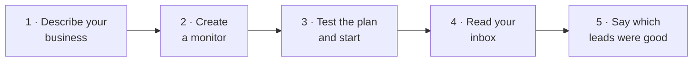

# Your first match

This walk takes about ten minutes. At the end, a monitor is running and
collecting conversations for you.

## 1. Describe your business

Open **Projects** and press **New project**. Answer three questions in your
customers' words, not in marketing language:

- **What is the product?** For example: *A task tracker for small teams.*
- **Who is it for?** For example: *Team leads at growing companies.*
- **What problem does it solve?** For example: *Tasks get lost across chat,
  email, and spreadsheets.*

Have a website or a document about your product? Open **Start from a website
or document**, and SignalScout drafts the answers for you. Read them before
you save.

<!-- screenshot: the new project form, answers filled in -->

A project holds these answers once, so every new monitor starts with them.
[Projects](../using/projects) says more.

## 2. Create a monitor

A monitor is one search that keeps running. On the project, press
**New monitor**. Setup has five steps, and nothing starts collecting until
you finish:

1. **Product.** The answers from your project, already filled in.
2. **Signals.** Which kinds of conversation matter: somebody *asking for
   recommendations*, *looking for alternatives*, *complaining about their
   current solution*, and more.
3. **Sources.** Which platforms to watch. A platform needs a connected
   account first.
4. **Search plan.** SignalScout writes the searches for each platform. Edit
   any phrase, delete the weak ones, add your own.
5. **Schedule & budget.** How often to look, and the most it may spend in a
   month.

::: info On SignalScout Cloud
A project and its monitor are made together, in four steps: there is no
schedule or budget step, because your plan sets both.
[SignalScout Cloud](../cloud/) says more.
:::

<!-- screenshot: the search plan step, one platform expanded -->

## 3. Test the plan, then start

On the last step, press **Test this plan**. SignalScout runs each search once,
against a small sample, and shows:

- how often each search finds a post;
- what a month would cost at your schedule;
- what the test itself cost.

A search that costs a lot and finds little is the one to delete. When the
numbers look right, press **Start monitor**.

<!-- screenshot: the cost test result -->

## 4. Read your inbox

The first posts arrive on the monitor's schedule. Open **Inbox**. Each match
shows the post, its score, and the reasons the model gave.

<!-- screenshot: the inbox with one match open -->

Nothing yet after the first run? That is normal for a narrow search. Open
the monitor to see what it collected and what the filters kept back.

## 5. Say which leads were good

Under each match, **Was this a good lead?** Press **Good lead** or
**Not relevant**. A match you mark **Not relevant** leaves the inbox. Your
verdicts are kept, and they show how often the score was right for your
business. [The inbox](../using/inbox) explains each part of a match.
