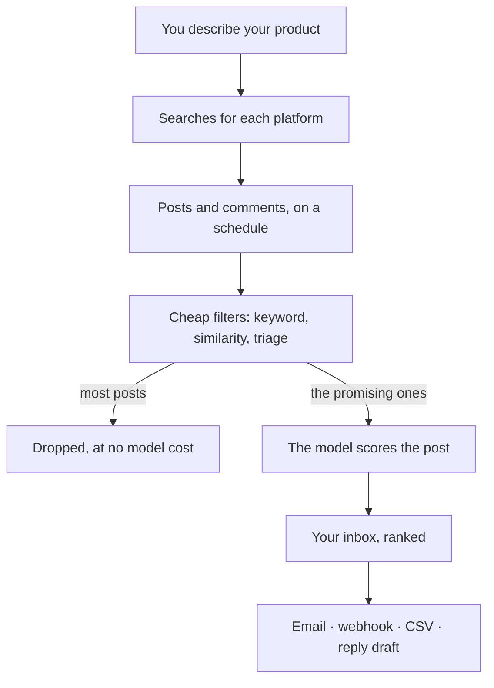

# What SignalScout does

SignalScout finds public conversations where somebody describes a problem
your product solves. It reads each one with an AI model, scores it, and puts
the best ones in your inbox.

Social listening tools answer *who mentioned my brand*. SignalScout answers
a different question:

> Who is publicly describing a problem my product can solve?

## How a conversation reaches your inbox

You describe your product once. SignalScout turns that into searches, runs
them on a schedule, and filters what comes back. Only a post that passes the
cheap filters is read by the model, because the model is the part that costs
the most.

## What a match tells you

Each match carries a score from 0 to 100, and the reasons behind it:

- **Problem fit** — does the person describe the problem you solve?
- **Fit with your customer** — are they the kind of person who buys from you?
- **Intent** — are they looking for a solution, or only complaining?

You read the reasons, not only the number. When a score is wrong, mark the
match **Not relevant**: it leaves your inbox, and your verdicts are kept, so
you can export them and see how often the score was right.

## What SignalScout does not do

- **It does not post for you.** A reply draft goes to your clipboard, and you
  post it yourself.
- **It is not a brand dashboard.** There are no sentiment charts, no share of
  voice and no competitor reports.

## Two ways to use it

| | SignalScout Cloud | Self-hosted |
|---|---|---|
| Who runs it | We do | You do, on your own server |
| Data and model keys | Included | You bring your own |
| Cost | A monthly plan | Free software; you pay your providers |
| Start | [signalscout.run](https://www.signalscout.run) | [The install on GitHub](https://github.com/rszhd/signalscout#running-it) |

Everything else in these guides is the same for both, and a page says so when
it is not.
