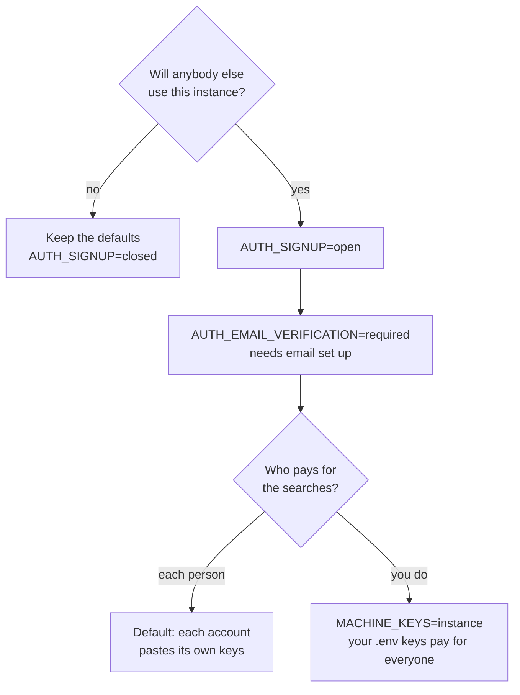

# Accounts and sign-up

The first visit to a new instance creates your account: a name, an email
address and a password of at least eight characters. There is no default
account and no default password.

By default, sign-up then **closes**. Every later attempt to register is
refused by the server.

## Letting other people in

Two settings decide who may register and how. Both default to the answer for
a server you run for yourself.



| Setting | Default | The other value |
|---|---|---|
| `AUTH_SIGNUP` | `closed`: one account, made on the first visit | `open`: anybody who reaches the page may register |
| `AUTH_EMAIL_VERIFICATION` | `off`: the address is taken as given | `required`: a link is sent, and nobody signs in until they open it |

### Opening sign-up changes whose keys pay

With `AUTH_SIGNUP=open`, the provider and model keys in `.env` are **not**
offered to other accounts. Each person pastes their own on the Connections
and Models screens, and a job with no key does not run. This stops a stranger
from spending money on your keys.

If you do want to pay for everyone, set `MACHINE_KEYS=instance`. Then every
account uses the keys in `.env`, and the bill is yours.

### Always verify addresses when sign-up is open

Without verification, anybody can register with an address they do not own,
and receive the email digests meant for the real owner. So with
`AUTH_SIGNUP=open`, also set `AUTH_EMAIL_VERIFICATION=required`.

Verification needs [email](./email). The app refuses to start with
`required` and no `SMTP_HOST` or `SMTP_FROM`, because every sign-in would
then wait for a link that is never sent.

What a person sees when verification is on:

1. They register, and the screen says *check your email*. No session starts.
2. They open the link. The address is confirmed and they are signed in.
3. A link works for 24 hours. If they sign in before opening it, the sign-in
   is refused and a new link is sent.

## Sessions

A session lasts seven days. Each day you use SignalScout, it is extended, so
daily use never signs you out. **Sign out** ends the session on the server,
not only in the browser.

## Locked out

**Stuck waiting for a verification email?** If mail is broken, confirm the
address by hand in the database:

```bash
docker compose exec postgres psql -U intentwatch intentwatch \
  -c "UPDATE users SET email_verified = true WHERE email = 'them@example.com';"
```

**Forgot the password?** The self-hosted build has no password reset,
because most installs have no mail server to send the link. The way back is
the database, which you own: make a new account, then move the old account's
data to it. With sign-up closed, delete the old account first, so the next
visit may create one. The repository's
[`docs/accounts.md`](https://github.com/rszhd/signalscout/blob/main/docs/accounts.md#locked-out)
has the exact SQL. Back up first.
