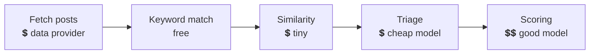

# What it costs you

SignalScout itself is free. The money goes to two kinds of provider, on your
own accounts:

- the **data provider**, for every page of posts it fetches;
- the **AI model provider**, for every post a model reads.

**Most of the money is spent at fetch time**, before any filter sees a post.
So the best way to spend less is a narrower search, not a stricter filter.

## Where the money goes in one poll

Each stage drops posts, so each paid stage after it reads fewer.

Rough prices, per item:

| Item | About |
|---|---|
| A Reddit post | $0.0003 to $0.0015, depending on the provider |
| An X post | $0.0002 |
| A LinkedIn post | $0.002 |
| An Instagram comment | $0.0027, the most expensive item |
| Scoring one post on a cheap model | $0.001 |

Instagram is the exception: its conversations are in the comments, so the
provider costs more than the model there.

## Three controls

### Test a plan before it runs

On the last step of a new monitor, **Test this plan** runs each search once,
against ten posts. It shows how often each search finds a post, what a month
would cost at your schedule, and what the test itself cost: about one and a
half cents per search on Reddit. It runs only when you press the button.

A plan whose estimate is above the monitor's cap is flagged search by search.
The monitor is then saved **without starting**, so you can narrow the
expensive search first.

### A monthly cap on each monitor

Each monitor can have a monthly cap. When it is reached, the monitor either:

- **Pause the monitor**: it stops, and waits until you raise the cap and
  resume it; or
- **Keep it, and start again next month**: it skips every poll for the rest
  of the month, then starts again by itself.

There is no cap by default: SignalScout does not decide how much of your key
it may spend. The cap can be passed by up to one poll, because a poll's cost
is known only after the provider answers.

### The filter

Three cheap stages sit in front of the scoring model: keywords, similarity,
and triage. Each monitor shows how many posts each stage kept back. You can
turn the whole filter off per monitor. It then costs more, and hides nothing.

::: warning A strict filter hides leads silently
An empty inbox looks the same whether the week was quiet or the filter
dropped good posts. The filter starts permissive on purpose. Check the
dropped counts on the monitor before you make it stricter.
:::

## Every figure is an estimate

SignalScout counts what each call reported and multiplies by a price it
knows. Your provider's invoice is the real number. The estimate can differ
because:

- a failed call may still be billed, but reported nothing;
- your provider's month may start on a different day than the calendar month;
- a provider can change its price;
- a free allowance is not taken into account.

So every amount on a screen is marked *estimated* and shown to four decimal
places. Use it to notice a monitor that spends too fast. Use the invoice to
know what you owe.
