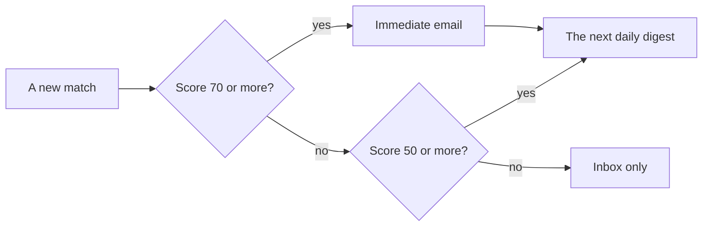

# Email

SignalScout sends email for two things:

- **Matches**: a daily digest, and an immediate email for a strong match.
- **Verification links**, if you set `AUTH_EMAIL_VERIFICATION=required`.

It sends through any SMTP server, using the Nodemailer library inside the
app. You need no extra service beyond your mail provider.

## Set it up

Add your provider's SMTP settings to `.env`, then run `docker compose up -d`.
For example, with Resend:

```bash
SMTP_HOST=smtp.resend.com
SMTP_PORT=465
SMTP_SECURE=true
SMTP_USER=resend
SMTP_PASSWORD=your-resend-api-key
SMTP_FROM=alerts@your-verified-domain.example
APP_URL=https://signalscout.example.com   # for the "Open the inbox" button
```

`SMTP_HOST` and `SMTP_FROM` are required. The others depend on your provider:

| Port | `SMTP_SECURE` | Meaning |
|---|---|---|
| 465 | `true` | TLS from the first byte |
| 587 | `false` | STARTTLS. The app requires the upgrade, and never sends a password unencrypted. |

A relay with no login may leave `SMTP_USER` and `SMTP_PASSWORD` empty.

::: warning Send from a domain you verified
On a provider's shared test domain, mail reaches only your own address. Every
other recipient is refused, and SignalScout cannot see that. Use an address on
a domain you verified with the provider, and send one test to somebody else
first.
:::

## What a new monitor sends

Every new monitor emails the account that created it, with no setup:



Change the times and the scores on the monitor's **Notifications** screen.
Open the monitor, then **Notifications**. You can also switch email off there.

- A digest holds up to 100 matches per email. A bigger day is split into
  several emails.
- Only matches found **after** you save the settings are sent. Your inbox
  keeps everything.
- A failed email is retried up to five times, and the failure is shown on the
  monitor.

An instance with no SMTP settings still works: the inbox fills as usual, and
the Notifications screen says which setting is missing.

## What an email looks like

Each email has a plain-text part and an HTML part, so a text-only mail client
loses the styling and nothing else. The HTML loads no images and no web fonts,
and it keeps a light background in dark-mode clients. Every match links to the
post it came from. The **Open the inbox** button appears only when `APP_URL`
is set.
