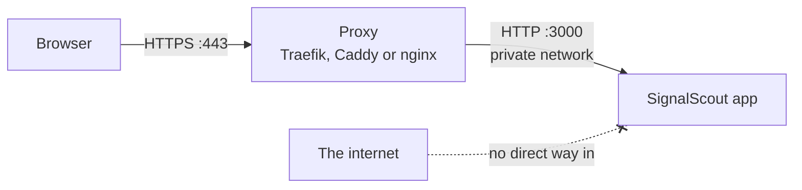

# HTTPS and the proxy

**Put SignalScout behind HTTPS before it has a public address.** Your
password and your session cookie travel with every request. On plain HTTP,
anybody between you and the server can read them, and a copied cookie is
already signed in.

A proxy in front of the app handles the certificate. The app itself only
speaks HTTP, on port 3000, to the proxy.



## Option 1: the proxy that ships with SignalScout

The repository includes a Traefik setup that gets a free certificate from
Let's Encrypt and redirects HTTP to HTTPS.

1. Point your domain's DNS at the server. The certificate cannot be issued
   before the name resolves.
2. Add two lines to `.env`:

   ```bash
   APP_HOST=signalscout.example.com
   ACME_EMAIL=you@example.com     # where certificate expiry warnings go
   ```

3. Download the two extra compose files, and start the proxy and the app:

   ```bash
   curl -O https://raw.githubusercontent.com/rszhd/signalscout/main/docker-compose.proxy.yml
   curl -O https://raw.githubusercontent.com/rszhd/signalscout/main/docker-compose.prod.yml
   docker network create signalscout-edge
   docker compose -p signalscout-proxy -f docker-compose.proxy.yml up -d
   docker compose -f docker-compose.yml -f docker-compose.prod.yml up -d
   ```

The second file stops the app from opening port 3000 on the server, so the
proxy is the only way in. The proxy runs as its own project: stopping the
app leaves the proxy and its certificates running.

## Option 2: a proxy you already have

Keep it. Caddy, nginx or another Traefik all work. Two rules:

- **Send `X-Forwarded-Proto: https`.** The app reads it to mark the cookie as
  secure. Without it, a sign-in seems to work and then does nothing. Caddy
  and Traefik send it by default. For nginx, add
  `proxy_set_header X-Forwarded-Proto $scheme;`.
- **Let nothing else reach port 3000.**

If your proxy is a Traefik on a Docker network, set `EDGE_NETWORK` to that
network, give this stack its own `TRAEFIK_NAME`, and start only the second
command above. The app carries its own router labels.

## The sign-in limit and `TRUST_PROXY`

SignalScout allows three sign-in attempts in ten seconds from one address.
Behind a proxy, only the proxy knows the real address, and it sends it in the
`X-Forwarded-For` header. `TRUST_PROXY` says which connections may send that
header.

| Your setup | `TRUST_PROXY` |
|---|---|
| Proxy on the same server or Docker network | Leave empty. Loopback and private networks are trusted. |
| Proxy reaches the app from a public address | That address, for example `203.0.113.4` |
| No proxy at all | `off` |

## When sign-in fails

| What you see | What it means |
|---|---|
| Sign-in seems to work, then you are signed out again | The proxy does not send `X-Forwarded-Proto: https`. |
| `403 Invalid origin` on every sign-in | The browser's address is not one the app trusts. Set `AUTH_URL` to the address people use, or list extra origins in `AUTH_TRUSTED_ORIGINS`, comma separated. |
