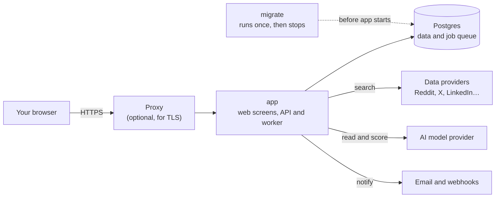

# Run SignalScout yourself

The self-hosted build is the whole product. Nothing is removed to make the
cloud worth paying for. You run it on your own server, and you bring the keys
for the data providers and the AI model you want to use.

## What you need

- **A server with 1 GB of memory**, or more. Intel or ARM: the image is
  published for both, so a Raspberry Pi or a cheap ARM server works.
- **Docker with Compose.** You do not need git, Node or a build.
- **A domain name**, if other people or other devices will reach it. It must
  sit behind HTTPS before it has a public address.
- **At least one data provider key and one AI model key.** One Reddit provider
  and one model are enough to start. [Providers and keys](./keys) lists them.

## What runs

SignalScout is one Postgres database and one application container. The
queue lives in Postgres too, so there is no Redis and no second database to
back up.

- **app** serves the screens and the API on port 3000, and runs the worker
  that polls, filters, scores and notifies.
- **migrate** updates the database schema before `app` starts, then stops.
- **postgres** holds everything: your keys, monitors, matches and the job
  queue.

The worker can run in its own container instead. That is a setting, not a
different image: see `WORKER_IN_PROCESS` in the
[configuration reference](./configuration#worker-in-process).

## The path through these pages

1. [Install](./install) — five commands, and the two secrets.
2. [Providers and keys](./keys) — which provider fetches which platform.
3. [AI models](./models) — which model does which job.
4. [HTTPS and the proxy](./https) — before the server has a public address.
5. [Email](./email) and [webhooks](./webhooks) — how matches reach you.

Then keep it running: [what it costs](./costs),
[backups and upgrades](./maintenance), and [troubleshooting](./troubleshooting).
