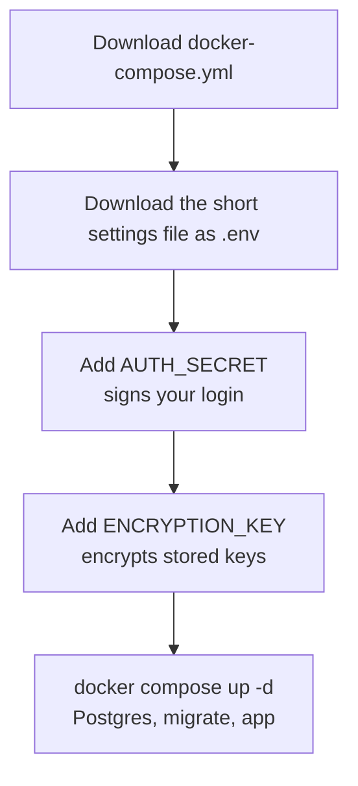

# Install

Five commands on a machine with Docker. Nothing is compiled on the server.

```bash
curl -O https://raw.githubusercontent.com/rszhd/signalscout/main/docker-compose.yml
curl -o .env https://raw.githubusercontent.com/rszhd/signalscout/main/.env.example.self-hosted
echo "AUTH_SECRET=$(openssl rand -base64 32)" >> .env
echo "ENCRYPTION_KEY=$(openssl rand -base64 32)" >> .env
docker compose up -d
```

Open <http://localhost:3000>. The first visit asks you to create your
account. After that, sign-up closes: nobody else can register unless you open
it ([Accounts and sign-up](./accounts)).

## What the five commands do



The two secrets are not in the file you downloaded. That file is public on
GitHub, and a secret everybody can read protects nothing.

| Secret | What it protects | If you lose it |
|---|---|---|
| `AUTH_SECRET` | Signs the session cookie. The app refuses to start without it. | Everybody is signed out. Nothing else. |
| `ENCRYPTION_KEY` | Encrypts the provider and model keys you paste on a screen. | Those keys are gone. You paste them again. |

::: warning Keep `.env` safe
`.env` holds both secrets and is not in a database backup. Copy it somewhere
safe now. [Backups](./maintenance#back-up) says why.
:::

## Before the server is public

Do two more things before anybody else can reach the address:

1. **Change the database password.** The file ships with
   `POSTGRES_PASSWORD=intentwatch`. Change it **before the first start**:
   Postgres takes the password when it creates the database, so changing it
   afterwards locks the app out of its own data. (The `DATABASE_URL` line is
   only for developers running `pnpm dev`; the containers build their own.)
2. **Put it behind HTTPS.** [HTTPS and the proxy](./https) takes three
   commands.

## Pin a version

`docker compose up` pulls `ghcr.io/rszhd/signalscout:latest`, which moves
with every release. On an instance you care about, pin the version, so an
upgrade happens only when you choose:

```bash
echo "SIGNALSCOUT_IMAGE=ghcr.io/rszhd/signalscout:0.14.0" >> .env
docker compose up -d
```

Tags exist for the full version (`0.14.0`), the minor version (`0.14`) and
`latest`. [Upgrade](./maintenance#upgrade) says how to move to the next one.

## Build from the source instead

If you want to change the code, clone the repository and build the image
yourself. This needs Node and pnpm:

```bash
git clone https://github.com/rszhd/signalscout
cd signalscout
pnpm setup
docker compose -f docker-compose.yml -f docker-compose.build.yml up --build
```

`pnpm setup` writes the same `.env` as the commands above, with both secrets.
