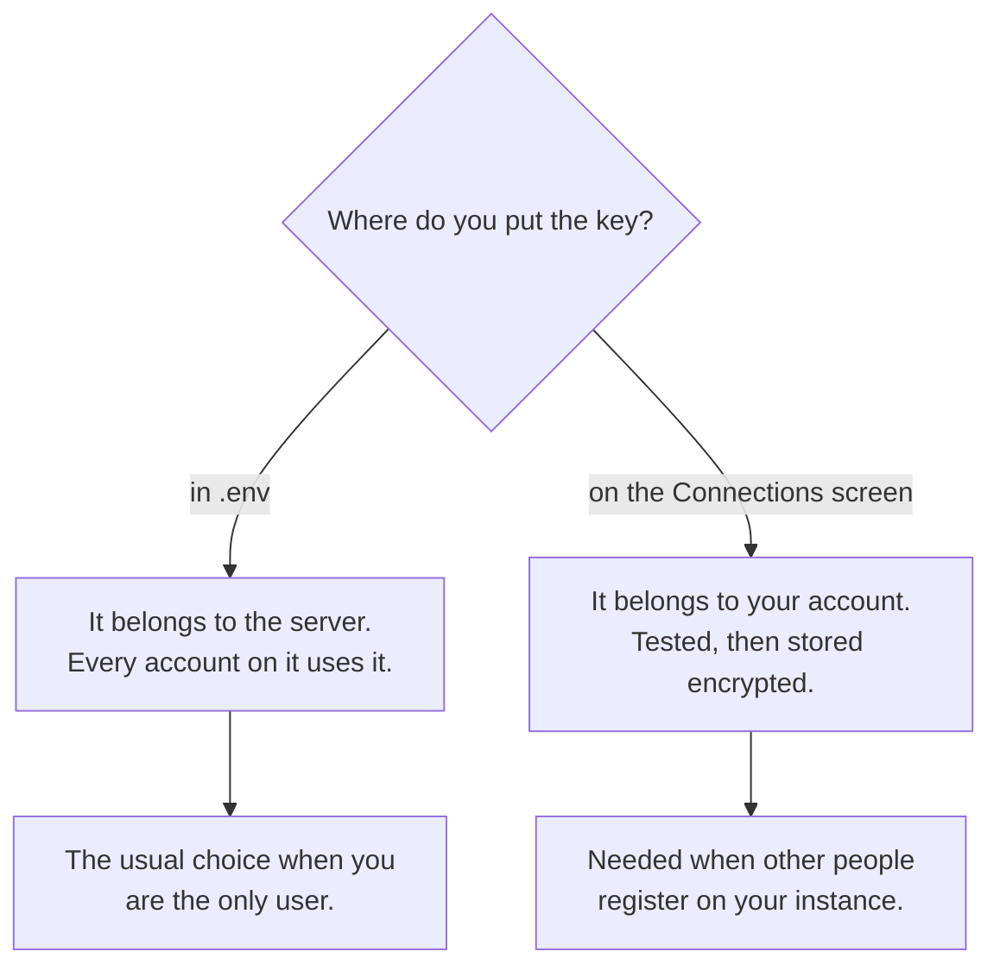

# Providers and keys

SignalScout does not scrape the platforms itself. A **data provider** runs the
search and sends the posts back, and you pay the provider for what it fetches.
You bring a key for each provider you want to use.

## Which provider fetches which platform

| Platform | Providers | Notes |
|---|---|---|
| Reddit | ScrapeCreators, SocialCrawl | ScrapeCreators has a free tier with no card. |
| X | SocialCrawl, SocialData | SocialData is prepaid. |
| LinkedIn | HarvestAPI, Apify | Both return the same posts, minutes old. HarvestAPI costs about a twelfth as much. |
| YouTube | ScrapeCreators, SocialCrawl | |
| TikTok | ScrapeCreators, SocialCrawl | |
| Instagram | SocialCrawl | Comments cost more than posts. See [costs](./costs). |

**Start small.** One Reddit provider and one AI model key already give you a
working product. A platform with no key simply cannot be ticked on the monitor
form.

**One key covers every platform its provider fetches.** A SocialCrawl key
serves five platforms, so you paste it once and rotate it once.

## Where a key goes

You can put a key in one of two places:



### In `.env`

```bash
SCRAPECREATORS_API_KEY=   # Reddit, YouTube, TikTok
SOCIALCRAWL_API_KEY=      # Reddit, X, YouTube, TikTok, Instagram
SOCIALDATA_API_KEY=''     # X. Keep the quotes: the key can contain a "|"
HARVESTAPI_API_KEY=       # LinkedIn
APIFY_API_TOKEN=          # LinkedIn
```

Run `docker compose up -d` after you change `.env`, so the containers read
it.

### On the Connections screen

Open **Providers** in the sidebar, then **Manage connections**. Press
**Connect** beside the provider, paste the key, and press **Test connection**.
The test asks the provider whether the key works, and it costs nothing. Then
press **Save key**. The key is encrypted with your `ENCRYPTION_KEY` before it
is stored.

::: tip Someone else registered on your instance?
With sign-up open, the keys in `.env` are **not** shared with other accounts.
Each person pastes their own. [Accounts and sign-up](./accounts) explains
why.
:::

## Two providers for one platform

If you hold keys for two providers of the same platform, SignalScout does not
pick one for you. The **Connections** screen asks you once and remembers your
answer. Until you answer, a poll for that platform refuses to start, because
a guess would spend money at a provider you did not choose.

A collection that is already running finishes at the provider that started
it, even if you change your choice in the middle.

## About the providers

Your data arrives through a company that is not the platform. You accept that
provider's terms, not the platform's, and those terms put the responsibility
for how you use the data on you. We would rather say that here than let you
find it in an agreement you did not read.
