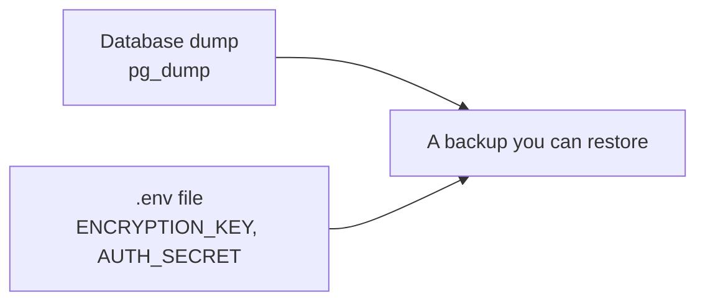

# Back up, upgrade and rotate the key

## Back up

One Postgres database holds everything: your keys, your monitors and your
inbox. A backup is two things, and **both** are needed:



**Dump the database:**

```bash
docker compose exec -T postgres pg_dump -U intentwatch intentwatch \
  | gzip > signalscout-$(date +%F).sql.gz
```

**Copy `.env` too.** The keys you pasted on a screen are stored encrypted
with `ENCRYPTION_KEY`, and that key is in `.env`, not in the dump. A dump
restored without it holds keys nobody can read, and each one must be pasted
again. Keep `.env` somewhere the dump is not.

**Restore** into an empty database:

```bash
gunzip -c signalscout-2026-09-22.sql.gz \
  | docker compose exec -T postgres psql -U intentwatch intentwatch
```

::: tip The database name
`intentwatch` is the old product name. It stays in the defaults, so an
existing database keeps its data. If you changed `POSTGRES_USER` or
`POSTGRES_DB`, use your values in these commands.
:::

## Upgrade

```bash
docker compose exec -T postgres pg_dump -U intentwatch intentwatch | gzip > backup.sql.gz
docker compose pull
docker compose up -d
```

**Back up first.** A release can change the database schema, and that change
cannot be undone.

The `migrate` container updates the database before the app starts. Watch it
with `docker compose logs migrate`. It prints `migrations applied to
intentwatch` when it is done.

If you pinned a version, change `SIGNALSCOUT_IMAGE` in `.env` to the new one
first. Read what changed on the
[Releases page](https://github.com/rszhd/signalscout/releases) before you do.

### If the upgrade fails

If `migrate` fails, the app does not start, on purpose: a half-updated
database that serves requests is worse than one that serves none.

1. Read `docker compose logs migrate`. It names the step that failed.
2. To go back, restore the backup, set `SIGNALSCOUT_IMAGE` to the version you
   had, and run `docker compose up -d`.

Always restore when you go back. The old version running on a database that
the new version already changed is not a state anybody has tested.

## Rotate the encryption key

Change `ENCRYPTION_KEY` if it may have leaked. Every stored key is
re-encrypted in one step, so no key is ever half on the old key and half on
the new one.

1. **Back up** the database, and keep the `.env` that holds the old key.
2. **Make a new key:** `openssl rand -base64 32`
3. **Stop the app:** `docker compose stop app worker`
4. **Re-encrypt**, with the old key still in `.env`:

   ```bash
   NEW_ENCRYPTION_KEY='<the new key>' docker compose run --rm -e NEW_ENCRYPTION_KEY \
     app node packages/pipeline/dist/secrets/rotate-cli.js
   ```

   It prints how many keys it re-encrypted.
5. **Put the new key** in `ENCRYPTION_KEY` in `.env`.
6. **Start the app:** `docker compose up -d`

The count in step 4 must equal the number of keys you stored: provider keys,
model keys and webhook secrets together. If anything fails, restore the
backup from step 1 and start again. Do not edit rows by hand.

If the key is **lost**, the stored keys are gone. There is no copy, by design.
Paste them again from each provider's dashboard.
