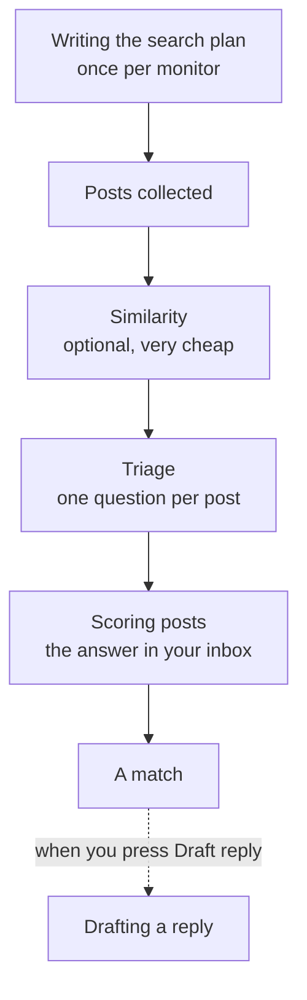

# AI models

SignalScout asks an AI model to do five different jobs. Each job can use its
own model, because the jobs have different shapes: one runs on every post,
one runs once per monitor, and one writes text with your name on it.

## The five jobs



| Job | What it does | Which model |
|---|---|---|
| **Writing the search plan** | Turns your four answers into the phrases and channels a monitor searches. | Your strongest model. It runs once per monitor, and it decides every post the monitor will ever collect. |
| **Similarity** | Compares a post with your monitor before any model is paid to read it. | An embedding model. Optional. |
| **Triage** | Asks one question about each post: could this author be a person to reach? | A model that is **cheaper** than scoring **and reliable** at this question, or none: turn it off. |
| **Scoring posts** | Reads a post and scores it. | A good model. This is the most expensive call. |
| **Drafting a reply** | Writes the reply you see when you press **Draft reply**. | A model that writes well. It never posts anything. |

## Set the model

The simplest setup is one provider and one model for everything, in `.env`:

```bash
AI_PROVIDER=anthropic   # openai | anthropic | google | deepseek | openrouter | ollama
AI_MODEL=claude-haiku-4-5
AI_API_KEY=
```

With `AI_PROVIDER=ollama`, you need no key: SignalScout talks to a model on
your own machine at `http://localhost:11434/v1`.

To give one job its own model, open **Models** in the sidebar. Each job opens
its own settings, and the screen suggests a model for your provider. Or set
the job's variables in `.env`: `AI_TRIAGE_*`, `AI_DRAFT_*`, `AI_PLAN_*` and
`AI_EMBEDDING_*`. The [configuration reference](./configuration#the-model)
lists them all.

## Two rules that save money

**Triage needs a model that is cheap and reliable, or none at all.**

- **Cheap**, because triage reads every post the free filters keep, and
  scoring then reads the ones triage keeps. The saving is only the price
  difference between the two models. With the same model on both, triage
  makes the bill larger, not smaller.
- **Reliable**, because a post triage drops never reaches scoring and never
  reaches your inbox. A cheap model that drops real leads saves money by
  losing the leads you run SignalScout for, and nothing shows it.

If you have no model that is both, set `AI_TRIAGE=off`. Every post then goes
to scoring: it costs more, and it hides nothing. If you do run triage, watch
the monitor page for a while: it counts the posts triage kept back. Many drops
and a quiet inbox is the sign to turn it off and compare.

**Similarity needs a provider that has embeddings.** Anthropic and DeepSeek do
not offer embeddings. On those, name another provider in
`AI_EMBEDDING_PROVIDER`, or the similarity stage stays off. Off drops nothing;
it only means more posts reach triage.

## Prices

SignalScout knows the prices of the common models, and shows an estimated
cost for each call. For a model it does not know, the cost shows as unknown,
never as a guess. Set the price yourself with the `*_PRICE_MICROS` settings,
in millionths of a dollar per million tokens, or on the Models screen.
[What it costs you](./costs) explains the estimates.
