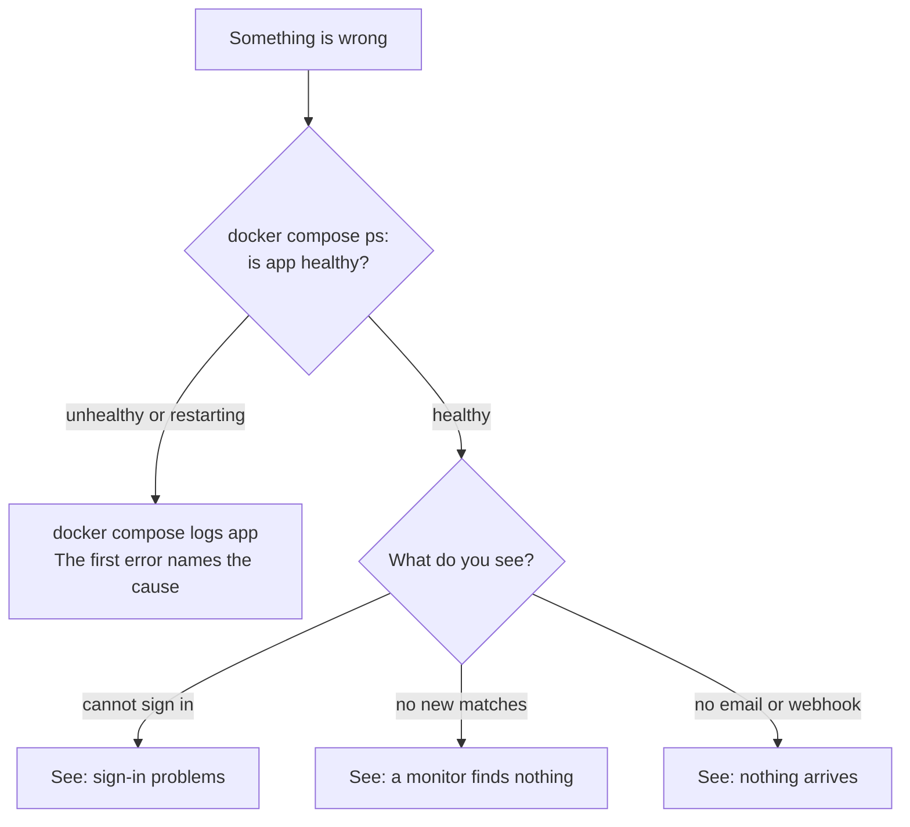

# Troubleshooting

Start at the top. Most problems show up in the first two checks.



## The app does not start

Run `docker compose logs app`. The app checks its settings at startup and
stops with a sentence that names the problem. The common ones:

| The log says | Do this |
|---|---|
| `AUTH_SECRET` is missing | Add it: `echo "AUTH_SECRET=$(openssl rand -base64 32)" >> .env` |
| A stored key cannot be decrypted | `ENCRYPTION_KEY` changed. Put the old one back, or [rotate](./maintenance#rotate-the-encryption-key) properly. |
| Verification needs SMTP | Set up [email](./email), or set `AUTH_EMAIL_VERIFICATION=off`. |
| `migrate` failed | See [If the upgrade fails](./maintenance#if-the-upgrade-fails). |

## Sign-in problems

| What you see | Cause |
|---|---|
| Sign-in seems to work, then you are signed out | Your proxy does not send `X-Forwarded-Proto: https`. See [HTTPS](./https#option-2-a-proxy-you-already-have). |
| `403 Invalid origin` | The address in the browser is not one the app trusts. Set `AUTH_URL` or `AUTH_TRUSTED_ORIGINS`. |
| Too many attempts | Three tries in ten seconds per address. Behind a proxy, check `TRUST_PROXY`. |

## A monitor finds nothing

1. **Open the monitor.** Its history shows every poll, what it collected, and
   how many posts each filter stage kept back. A refused poll says why.
2. **Check the cap.** A monitor whose cap is spent does not poll.
3. **Check the keys.** A platform with no working key is skipped, and the
   monitor says which key it wants.
4. **Check the filter.** If most posts stop at a filter stage, try the
   monitor with the filter off for a day.

### Look inside the queue

The job queue is a set of tables in your own Postgres. Open a database shell:

```bash
docker compose exec postgres psql -U intentwatch intentwatch
```

Then:

```sql
-- What is waiting, running or failing, per queue.
SELECT name, state, count(*) FROM pgboss.job GROUP BY name, state;

-- Jobs that failed every attempt. Nothing retries them.
SELECT source_name, created_on, output FROM pgboss.job
WHERE name = 'dead-letter' ORDER BY created_on DESC LIMIT 20;

-- When each monitor last polled.
SELECT name, last_polled_at FROM monitors;
```

A failed job is retried five times over about an hour. Then it moves to
`dead-letter` and stops, so a broken job cannot keep spending your money
while nobody watches. Fix the cause; the next scheduled poll runs normally.

## Nothing arrives by email or webhook

- **Email:** the monitor's **Notifications** screen names any missing setting
  and shows the last failure. Check that `SMTP_FROM` is on a domain you
  verified with your mail provider.
- **Webhook:** after five failures in a row the webhook turns itself off. The
  Notifications screen shows the error. Fix the receiver, turn it on, save.
- **Only new matches are sent.** Matches found before you saved the settings
  stay in the inbox and are not sent.

## Still stuck

Ask in [GitHub Discussions](https://github.com/rszhd/signalscout/discussions).
Include the output of `docker compose ps` and the first error in
`docker compose logs app`. Remove any keys from the logs first.
