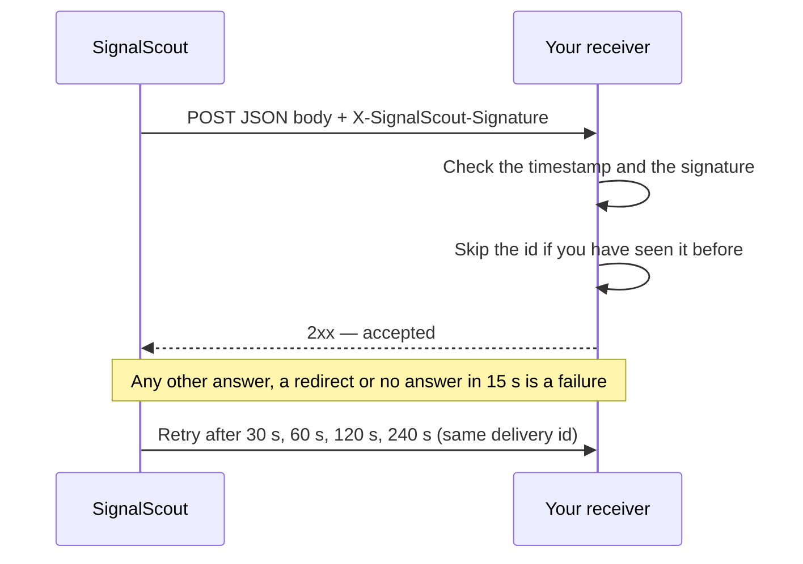

# Webhooks

A webhook sends your matches to a URL you choose, as a signed JSON `POST`.
Use it to feed a CRM, a spreadsheet, or your own code.

Webhooks start **off**. Turn one on in the monitor's **Notifications**
screen, choose **Digest** or **Each match above the minimum score**, and
enter an HTTPS URL.

## How a delivery works



After five failures in a row, SignalScout turns the monitor's webhook off
and shows the failure on the monitor. Fix the receiver, then turn the webhook
on again and save. Email is not affected.

## The request

```json
{
  "version": 1,
  "id": "delivery-uuid",
  "type": "matches.digest",
  "createdAt": "2026-09-05T00:00:00.000Z",
  "monitor": { "id": "monitor-uuid", "name": "QA conversations" },
  "matches": [
    {
      "id": "match-uuid",
      "score": 90,
      "reasons": ["A small team asks for help with testing"],
      "source": "reddit",
      "url": "https://www.reddit.com/r/example/comments/example",
      "excerpt": "How do other small teams test before a release?",
      "author": "example",
      "postedAt": "2026-09-04T23:00:00.000Z"
    }
  ]
}
```

- `type` is `match.created` for one match and `matches.digest` for a digest.
- `author` may be `null`. Times are UTC, in ISO 8601.
- A retry may carry **fewer** matches than the first attempt: a match you
  hid in the meantime is left out.

| Header | Value |
|---|---|
| `Content-Type` | `application/json` |
| `X-SignalScout-Id` | The delivery id. The same on every retry. |
| `X-SignalScout-Timestamp` | The time of this attempt, in Unix seconds |
| `X-SignalScout-Signature` | `v1=` and a hexadecimal HMAC-SHA256 |

Slack and Discord cannot read this body directly. Put a small receiver in
between that turns it into their message format.

## Verify the signature

The signature is an HMAC-SHA256 of `timestamp + "." + raw body`, keyed with
your signing secret. A correct receiver does five things:

1. Read the **raw** request bytes, before any JSON parsing.
2. Compute the HMAC and compare it in constant time.
3. Refuse a timestamp more than five minutes from your clock.
4. Skip a delivery id it has already processed.
5. Mark the id as processed only after the work is safely stored.

In Node.js:

```js
import { createHmac, timingSafeEqual } from "node:crypto";

export function verify(rawBody, headers, secret) {
  const timestamp = headers["x-signalscout-timestamp"];
  const signature = headers["x-signalscout-signature"] ?? "";

  if (Math.abs(Date.now() / 1000 - Number(timestamp)) > 300) return false;

  const expected =
    "v1=" + createHmac("sha256", secret).update(`${timestamp}.${rawBody}`).digest("hex");

  const a = Buffer.from(signature);
  const b = Buffer.from(expected);
  return a.length === b.length && timingSafeEqual(a, b);
}
```

A delivery can arrive twice: if SignalScout stops after your receiver said
yes but before it recorded that, the retry sends it again. Step 4 is what
makes that harmless.

## The signing secret

Each account can make its own secret. On the **Notifications** screen, press
**Generate a secret**. It is shown **once**, so copy it into your receiver
before you leave the page. Every monitor you own signs with it.

- **Generating a new secret** stops the old one at once, including for
  deliveries already waiting. That is how you replace a leaked secret.
- **Without an account secret**, SignalScout signs with
  `WEBHOOK_SIGNING_SECRET` from `.env`. Make one with `openssl rand -hex 32`.
- **With sign-up open**, `WEBHOOK_SIGNING_SECRET` is never used, because
  every account could read it. Each account must generate its own.

## Where a webhook may point

Every instance requires an HTTPS URL, refuses a username or password inside
the URL, and does not follow redirects.

With sign-up open, the URL is a stranger's text, and your server makes the
request. So a webhook must then point to the public internet: `localhost` and
private network addresses are refused. On a server you run for yourself,
nothing more is refused, because a receiver in the next container is normal.
