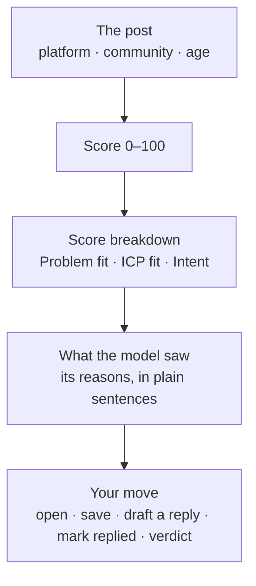

# The inbox

The inbox is where matches arrive: conversations a monitor found and the
model scored at or above the monitor's minimum. Each project has its own.

<!-- screenshot: the inbox, the list on the left and one match open on the right -->

The list is on the left, and the open match is on the right. On a phone, the
match opens on its own screen, with **← Back to inbox**.

## Reading a match

Each match shows the post, where it came from, and why it scored:

- **Score breakdown** — *Problem fit*: does the person describe the problem
  you solve? *ICP fit*: are they your kind of customer? *Intent*: are they
  looking for a solution now?
- **What the model saw** — the reasons behind the score, one per line. Read
  these before you trust the number.
- **Open conversation ↗** — the original post on its platform.

## What you can do with a match

| Button | What it does |
|---|---|
| **Open conversation ↗** | Opens the post on its platform, in a new tab. |
| **Copy link** | Copies a link to this match inside SignalScout, to send to a colleague. |
| **Save for later** | Keeps the match under **Saved**. |
| **Draft reply** | Writes a reply for you to edit and post yourself. See [reply drafts](./replies). |
| **Mark as replied** | Records that you answered this conversation. The match stays in the inbox, and its card says **Replied**. Press it again to take the mark back. |
| **Good lead** / **Not relevant** | Your verdict. **Not relevant** removes the match from the inbox. |

Removed a match by mistake? Open **Filters**, set **Not relevant** to
**Shown**, and it comes back.

## Finding the right matches

| Control | Choices |
|---|---|
| **Inbox** / **Saved** | Every match, or only the ones you saved |
| **Monitor** | All monitors, or one |
| **Order** | Ranked by score & age, highest score first, or newest first |
| **Filters** | A minimum score, whether to show matches marked not relevant, and whether to show matches you replied to |

"Ranked by score & age" is the default. A strong match from last week drops
below a good one from this morning, so the top of the list is what to read
today.

## Export

**Export CSV** downloads the matches in your current view, for a
spreadsheet or a CRM. Your verdicts, and whether you saved or replied to
each match, are in it too.
