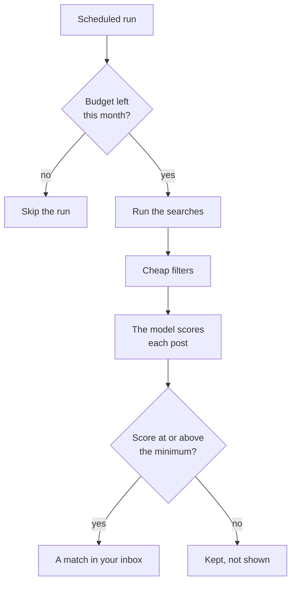

# Monitors

A monitor is one search that keeps running on a schedule. It belongs to a
project, watches the platforms you pick, and puts what it finds in that
project's inbox.

## What a monitor does on each run

## Create a monitor

Open the project and press **New monitor**. Five steps:

| Step | You decide |
|---|---|
| **Product** | Name the monitor. The project's answers are filled in; edit them for this monitor if you need to. |
| **Signals** | Which kinds of conversation matter. Pick at least one. |
| **Sources** | Which platforms to watch, and whether to **Include replies and comments**. |
| **Search plan** | The searches for each platform. SignalScout writes them; you can edit every phrase. |
| **Schedule & budget** | How often, which days, the monthly budget, and the minimum score. |

The signals you can pick:

- Asking for recommendations
- Looking for alternatives
- Complaining about their current solution
- Describing the problem
- Comparing products
- Ready to buy
- Looking to hire someone

<!-- screenshot: the signals step with three signals picked -->

### Replies and comments

A person who describes the problem under somebody else's post is just as good
a lead. **Include replies and comments** reads them too. It finds more people,
but the model reads more text, so it costs more.

### The search plan

Keep the searches **focused**. A short, specific phrase that people really
write finds better conversations than a broad one, and costs less. Use plain
phrases of at least two words; `AND` and `OR` are not supported. On Reddit
you can also name subreddits to watch.

### Schedule and budget

| Setting | Choices |
|---|---|
| **How often** | Every hour, every 3, 6 or 12 hours, once a day, once a week |
| **Which days** | Every day, weekdays, weekends, or the days you choose |
| **Monthly budget** | Required. The most the monitor may spend in a month, in dollars. |
| **When it is reached** | **Pause the monitor**, or **Keep it, and start again next month** |
| **Minimum score to match** | A post becomes a match at this score or above. Default: 30. |

::: warning A high minimum score hides leads
A post under the minimum is scored, paid for, and never shown. Start low, and
raise the number only when your inbox has too much noise.
:::

Before you start, press **Test this plan** to see what a month would cost.
[What it costs you](../self-hosting/costs#test-a-plan-before-it-runs)
explains the numbers.

## The monitor page

Open a monitor from **Monitors** to see how it is doing.

<!-- screenshot: the monitor page, overview and recent activity -->

- **Current activity** — what the monitor is doing now.
- **Recent activity** — every run: what it collected, what each filter kept
  back, and what the model scored. A run that was skipped says why.
- **Search performance** — for each search: posts, matches, best score. A
  search that finds posts but never a match costs money on every run.
  Delete it.
- **Lead sources** — which platforms and which kinds of post bring the best
  leads.
- **Cost** — spent this month and budget left. Every amount is an estimate.

### Settings you can change later

Under **Monitor settings**: the schedule, the monthly budget, the minimum
score, and **Which posts the AI reads**:

- **Only the promising ones** — the cheap filters decide first. Cheaper, and
  a few real leads may be missed.
- **Every post found** — the model reads everything. Costs more, misses
  nothing.

**Pause** stops a monitor and keeps its matches. **Resume** starts it again.
