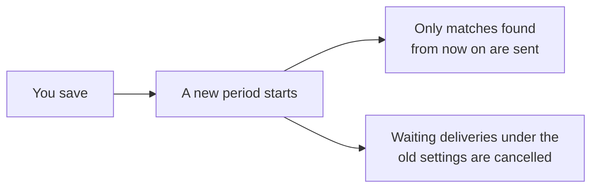

# Notifications

You do not have to watch the inbox. A monitor can send its matches to you by
email, or to your own system by webhook.

**A new monitor already emails you**: a daily digest of matches scoring 50 or
more, and an immediate email for a match scoring 70 or more.

## Change them

Open the monitor, then **Notification settings**. Each monitor has its own.

<!-- screenshot: the notifications screen, digest and email sections -->

| Setting | What it does |
|---|---|
| **Digest interval (hours)** | How often the digest is sent. 24 is once a day. |
| **Minimum score** | The lowest score that goes into the digest. |
| **Email digest** | Turns the digest email on or off. |
| **Recipient email** | Where the email goes. |
| **Immediate email alerts** and **Immediate alert score** | An email for each match at or above this score, as soon as it is found. |
| **Enable webhook**, **Webhook URL**, **Webhook delivery** | Sends matches to your URL. See [webhooks](../self-hosting/webhooks). |

Press **Save notifications**.

Saving starts a new period. Matches found before you saved stay in your inbox
but are not sent, so a changed recipient never receives somebody else's old
matches.

## Good to know

- **A quiet period sends nothing.** No empty digests.
- **Immediate alerts also appear in the next digest**, so the digest is
  complete on its own.
- **A paused monitor still delivers** the matches it already found.
- **A failure shows on the monitor.** A webhook that fails five times in a
  row turns itself off until you fix it and save again.

On a self-hosted instance, email needs a mail server first:
[Email](../self-hosting/email).
