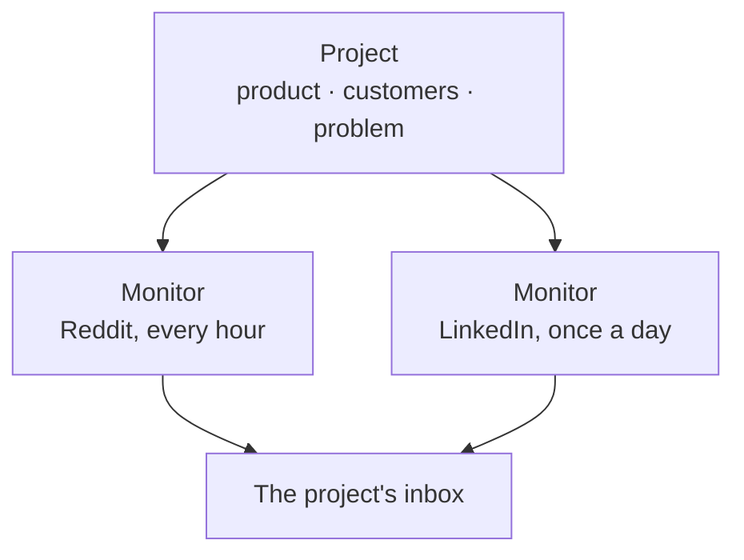

# Projects

A project is one business: its product, its customers, and the problem it
solves. Its monitors, and the matches they find, belong to it.

Most people need one project. Add another for a second product or a client
you work for, so each inbox stays about one business.

## Create a project

Open **Projects**, then **New project**. Give it a name, and answer three
questions:

| Question | Write | Example |
|---|---|---|
| **What is the product?** | What it is and what it does | A task tracker for small teams |
| **Who is it for?** | The team, role or kind of company that buys | Team leads at growing companies |
| **What problem does it solve?** | The problem, in the words a customer would post | Tasks get lost across chat, email, and spreadsheets |

A sentence or two each is enough. **Use your customers' words.** SignalScout
searches for the way people describe a problem, and people rarely use your
product's vocabulary.

<!-- screenshot: the project form, answers filled in -->

### Start from your website

Open **Start from a website or document**. Enter your product's address and
press **Read this page**, or add a text, Markdown or HTML file. SignalScout
drafts the three answers. An answer the document did not support is marked
as a guess, so check those first. Nothing is saved until you press
**Create project**.

## Edit a project

On the project's card, press **Edit**. A change applies to monitors you
create **after** it. Each monitor keeps the copy of the answers it was made
with, so an edit never changes a monitor that already works.

## Delete a project

Press **Delete** on its card, then **Yes, delete**.

::: danger Deleting a project deletes its monitors
Its monitors go with it, and so do their matches and your verdicts on them.
This cannot be undone. To stop collecting but keep the matches, pause the
monitors instead.
:::

<!-- screenshot: the projects list with two project cards -->
