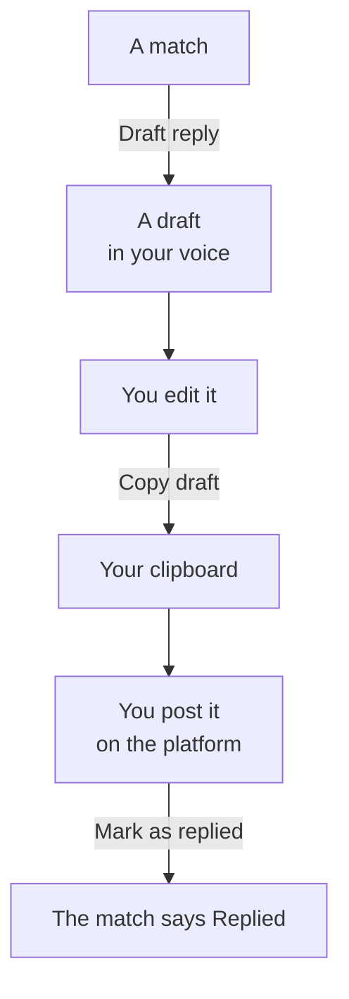

# Reply drafts

When a match is worth answering, SignalScout can write a first draft of the
reply. You edit it, copy it, and post it yourself. **Nothing is ever posted
from SignalScout.**

## Draft a reply

Open the match in your inbox and press **Draft reply**. The draft appears in
an editable box.

<!-- screenshot: a match with its reply draft open -->

- **Draft again** writes a new version.
- **Voice and guidance** opens two choices for this one reply: a **Writing
  voice** from your saved voices, and **Customize**, where you add guidance,
  for example: *Answer the pricing question first, and keep it to three
  sentences.* The guidance applies to this draft only.
- **Copy draft** puts the text on your clipboard. SignalScout then asks
  **Did you post it?** Press **Yes, mark as replied** after you post, so the
  inbox shows that you answered. Copying alone marks nothing.

Read the draft before you post it. It carries your name into somebody else's
conversation.

**A draft never opens with your product.** It answers the person first, and
it cannot invent facts about what you sell. A reply that reads as an
advertisement gets ignored or removed.

## Reply voices

A voice is saved writing guidance, so every draft sounds like you. Open
**Voices** in the sidebar.

- **Start with a preset**, then change it to fit, or
- press **New voice** and write your own.

A useful voice says how you write: your tone, how long a reply should be, and
words to use or avoid. For example:

> Lead with a practical answer. Use short paragraphs and everyday language.
> Skip exclamation marks and sales jargon.

Your voices are available in every project. When you draft, choose one as
the **Writing voice** under **Voice and guidance**.

<!-- screenshot: the reply voices screen with one voice open -->

## What a draft costs

Each draft is one call to the AI model, on the **Drafting a reply** model.
A draft is written only when you press the button, never on a schedule.

::: info On SignalScout Cloud
Your plan includes a number of reply drafts each month. The **Billing**
screen shows how many are left.
:::
